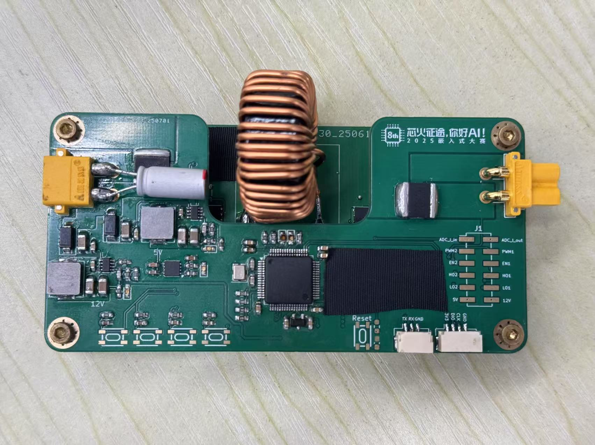
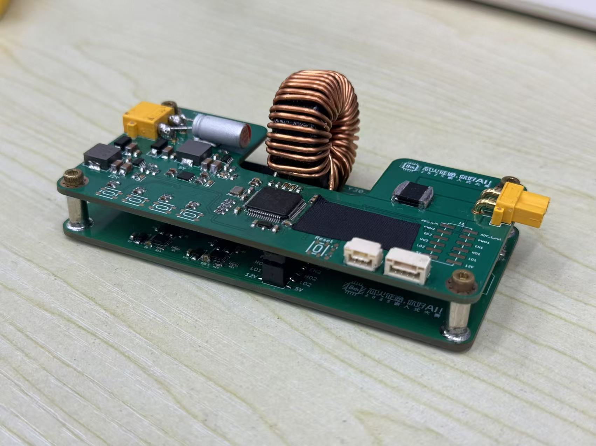
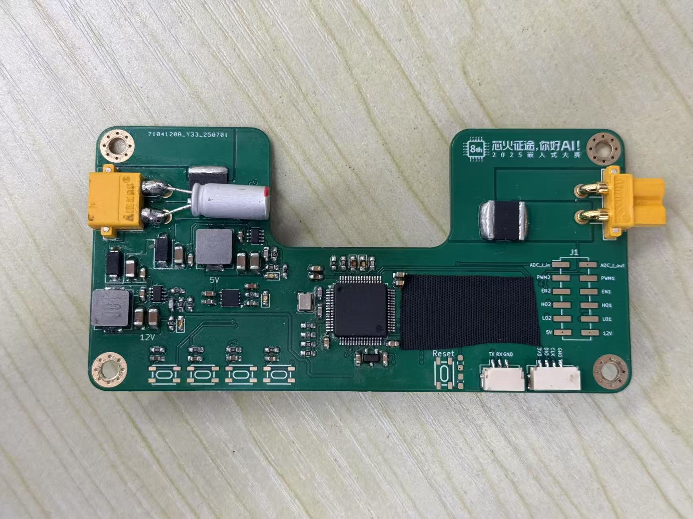
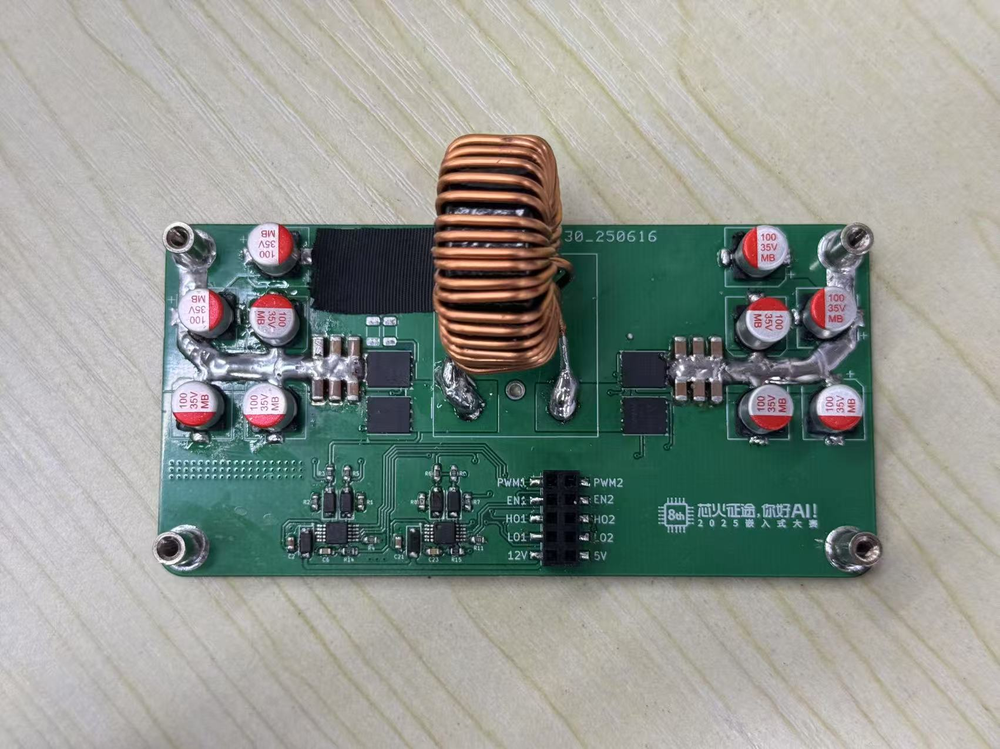
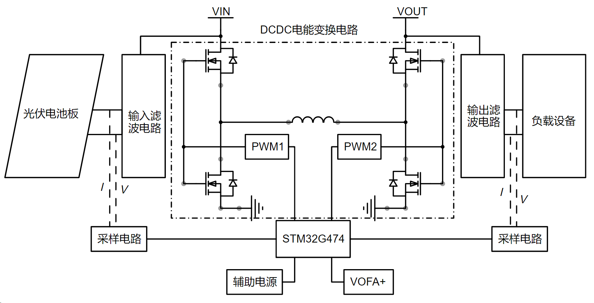

&nbsp;&nbsp;

[English](./README.md)/中文

***
初赛演示视频：[2025年嵌入式设计大赛ST赛道-基于 STM32G4 平台的数控 MPPT 四开关 buckboost 变换器](https://www.bilibili.com/video/BV1jSGMzNE3r/?spm_id_from=333.1387.homepage.video_card.click&vd_source=abfcf92775ddd86e25fb9949e3e04cfe)

# 作品实物图

# 1. 作品简介

## 1.1 关键性能指标
**输出电压：**
最高输出电压：11.604V

最低输出电压：16.167V

**稳态平均功率：**

13.785W

**稳态功率波动：**

0.14%

**最大功率点跟踪效率：**

97.9%
## 1.2 主要创新点

1. 双模式 MPPT 算法：结合 CV 法快速定位与 P&O 法动态跟踪，提高追
踪精度，加强了抗光照突变干扰能力。

2. 太阳能控制器硬件部分采用双板结构：控制板含 MCU 最小系统、采
样电路及调试接口；功率板集成主变换电路、驱动及滤波电路。全部设计基
于 KiCad 完成，兼顾调试便利与高低压隔离需求。

3. 使用 PSIM 仿真：充分利用 PSIM 仿真软件进行算法验证和参数优化，
实现了仿真与硬件开发的双线并行，提高了工作效率，还能提前发现潜在问
题，为后续硬件调试奠定了坚实基础。

# 2. 系统介绍

下图所示的太阳能控制器系统包含以下核心模块：DC-DC 电能变换电路、电压电流采样电路、输入输出滤波电路以及辅助电源电路。系统工作原理如下：

能量输入与处理：光伏电池板转换的太阳能电能，经输入滤波电路预处理后，输入至 DC-DC 变换电路。

状态监测：STM32G74 微控制器周期性采集经采样电路获取的输入/输出电压电流数据。

核心控制：微控制器对采集数据进行线性拟合，并运行内部 MPPT 算法，计算出控制指令。

功率调节：控制指令转化为PWM信号输出至栅极驱动器，驱动 DC-DC 变换电路的功率开关器件，从而动态调整其工作状态（如占空比），实现对输入或输出电参数的精准控制。

通信交互： 控制器通过 UART 接口与上位机软件 Vofa+ 通信，支持参数远程设定及实时运行数据（电压/电流）反馈。

安全保障与供电：

输入端设有防电流倒灌电路，防止能量逆向流动。

辅助电源电路集成提供 12V、5V 和 3.3V 的板级电源，为控制器内部所有模块稳定供电。

考虑到调试方便性以及高低压域分割问题，本文中的太阳能电池板控制器的硬件系统主要由控制部分与功率部分两块 PCB 板组合而成，其如图 2 所示，控制部分主要包括主控 MCU 最小系统、辅助电源、采样电路、调试接口和指示灯；功率部分主要包括电能变换主电路，输入输出滤波电路和栅极驱动电路。本作品的硬件全流程设计均基于 Kicad 软件。

